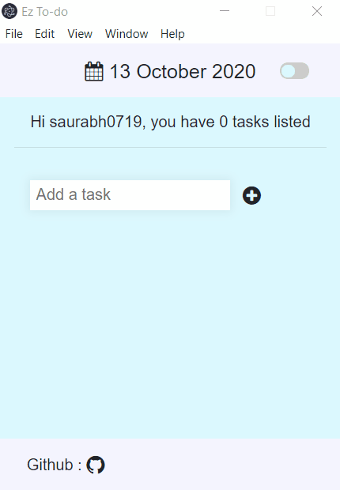

# EZ-ToDo app

A clean to-do list app made on Electron

<p align="center">

  </p>

### Installation steps
Clone the repository :
```sh
$ git clone https://github.com/saurabh0719/ez-ToDo.git
```
Install npm dependencies :
```sh
$ npm install
```
Run it :
```sh
$ npm start
```
